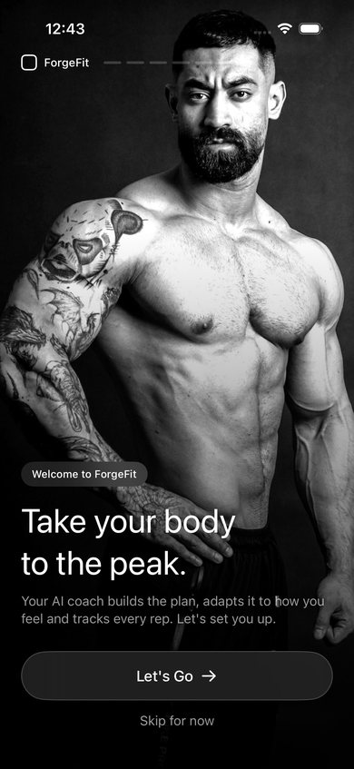
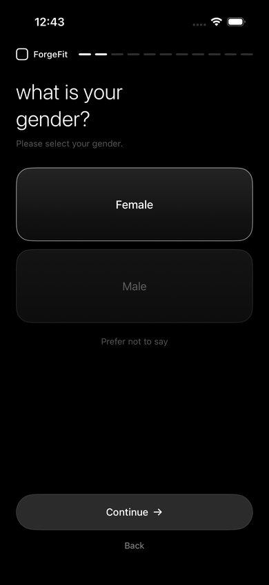
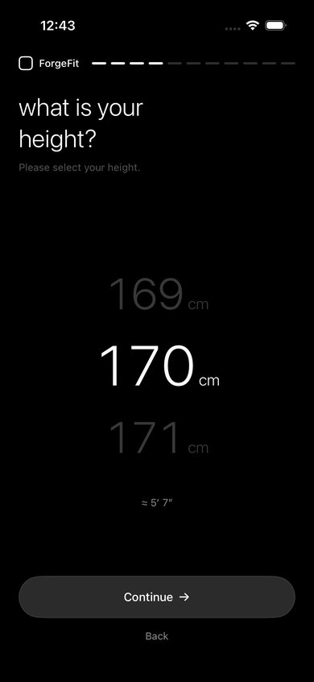
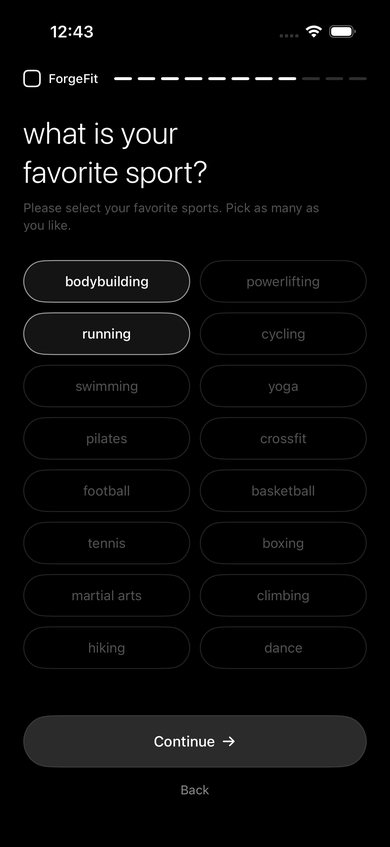
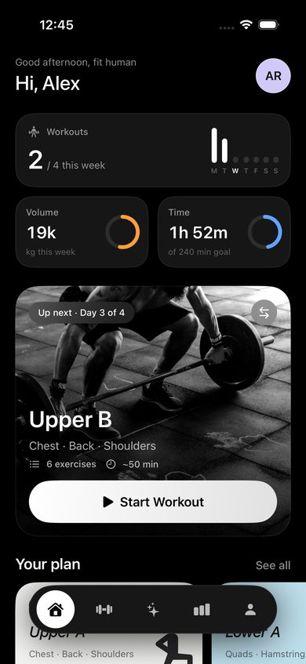
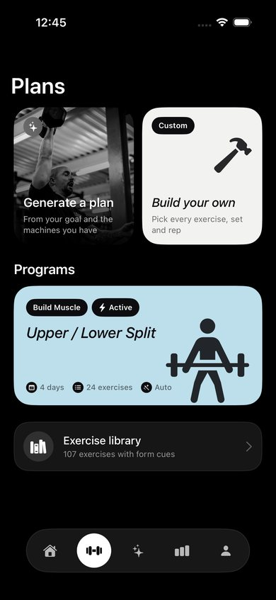
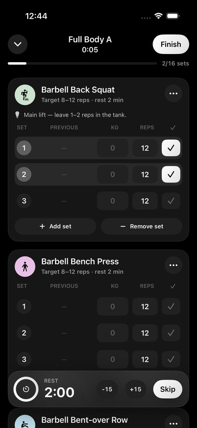
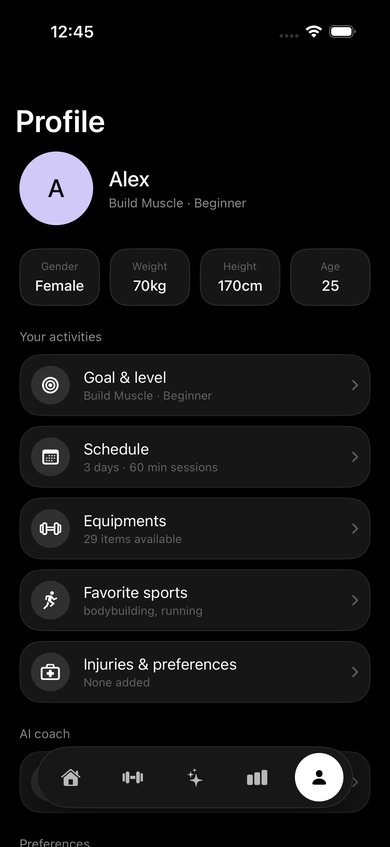

# ForgeFit — AI Gym Coach for iPhone

ForgeFit is a native SwiftUI iPhone app that builds your workout plan, tracks every set, and has an AI coach (powered by Google Gemini) you can talk to about your struggles — it rewrites your plan to fit.

<p align="center">
  
  
  
  
</p>
<p align="center">
  
  
  
  
</p>

## Features

**Onboarding**
- Name, gender, age, height and weight (number wheels, kg/lb), main goal, experience, favorite sports, schedule, equipment and injuries. The answers feed the plan generator and the AI coach.

**Plans**
- **AI plan generator**: pick your goal, experience, days per week, session length, the **machines & equipment you have**, and optional focus muscles or notes (e.g. "bad left knee"). Gemini designs a full weekly program with sets, rep ranges, rest times and cues.
- **Instant generator**: the same inputs, built on-device with no internet or API key needed.
- **Build your own**: create days, add exercises from a 100+ exercise library (filter by muscle and your equipment), and set sets, reps and rest for each one.
- Edit, duplicate and switch between saved plans. The app rotates to the next day after each workout.

**Workout tracking**
- A live workout screen with weight, reps and time inputs, and your previous numbers for every set.
- **Progressive overload:** each exercise suggests today's target from last time ("62.5 kg × 8: you hit 12 reps on every set, so add 2.5 kg"). Workouts start prefilled with it, and one tap applies it.
- **Warm-ups and plates:** generate warm-up sets (empty bar, then 40/60/80%) and open a plate calculator that draws the plates for each side (kg or lb).
- **Supersets, drop sets and RPE:** link exercises into supersets (no rest until the round is done), add drop sets, and mark sets as warm-up, drop or to failure. Log RPE per set.
- **Swap exercise:** replace a machine that's taken with an alternative for the same muscle that your equipment allows. Sets you've already done stay logged.
- **How-to guides:** setup steps, common mistakes, a form cue and an animated rep-tempo guide for all 107 exercises, plus a link to form videos.
- A rest timer that starts automatically, with ±15 s and skip. It also runs on the **Lock Screen and in the Dynamic Island** (Live Activity) and sends a notification if the app is in the background.
- Add or remove exercises and sets mid-workout, minimise the workout and resume it later.
- A finish summary with duration, volume, sets and an effort rating (1–10) plus notes, then a celebration screen with new PRs, badges and a **share card** for Instagram Stories.

**Progress**
- Weekly volume and workouts-per-week charts.
- Body weight logging and a trend chart.
- An estimated 1-rep-max strength chart for each exercise, a personal-records leaderboard, and full workout history. Every past workout can be shared as an image.
- **Streaks and badges:** a weekly training streak and 21 badges, from your first workout to 100, 2-plate bench, 4-plate deadlift, 100 tonnes lifted, Early Bird and Protein Pro.

**Nutrition**
- **Snap your meal:** take a photo (or describe it) and Gemini estimates the calories, protein, carbs and fat of each item. You can review and edit everything before saving, or add meals by hand.
- Daily calorie and protein targets from your weight, height, age, training days and goal (Mifflin–St Jeor), which you can override.

**AI coach chat**
- Tell the coach what's going on ("my knees hurt when I squat", "I only have 30 minutes", "I've stalled"). It sees your profile, current plan, recent workouts, effort ratings, RPE and nutrition.
- When a change would help, it proposes a complete revised plan as a card you can **preview and apply** with one tap.
- **Weekly check-in:** once a week, Home offers a check-in. The coach reviews the week (sessions vs plan, skipped exercises, stalled lifts, effort, nutrition) and suggests plan changes.
- Replies stream in live, and you can stop a reply partway.

**Reminders**
- Workout reminders on the days you choose (they mention your next workout and your streak), plus an optional Sunday check-in reminder.

**Accounts & cloud save**
- Create an account with email and password, or log in from the welcome screen ("I have an account") or **Profile → Save your progress**.
- Your profile, plans, workouts, weigh-ins and coach chat are saved to your account a few seconds after each change, and are downloaded when you log in on another iPhone. If two phones changed at the same time, both sets of workouts are kept.
- The app still works fully offline, with or without an account. Password reset, change password, log out and delete account are all built in.

**Design**
- Monochrome "dark mode done right": pure black canvas, graphite cards, white actions and soft pastel program cards with black tags and italic titles.
- Photo welcome screen, onboarding questions with number wheels and outlined chips, and a floating capsule tab bar.
- Photos by mehdi pezhvak, Victor Freitas and Marvin Cors on [Unsplash](https://unsplash.com) (Unsplash License), converted to black and white.

## Get the IPA

Every push runs the **Build iOS IPA** GitHub Action on a macOS runner (the **UI Tests & Screenshots** workflow also runs the app on an iPhone simulator and uploads screenshots):

1. Go to **Actions → Build iOS IPA → latest run**.
2. Download the **ForgeFit-ipa** artifact and unzip it to get `ForgeFit.ipa`.
3. Pushing a tag like `v1.0.0` also attaches the IPA to a GitHub Release.

The IPA is **unsigned**. Install it with a sideloading tool that signs it with your Apple ID:
- [AltStore](https://altstore.io) or [Sideloadly](https://sideloadly.io) (free Apple ID, re-sign every 7 days), or
- your own Apple Developer account (for example with `codesign`, Xcode, or an online signing service).

## Enable the AI coach

1. Create a free API key in [Google AI Studio](https://aistudio.google.com) (**Get API key**).
2. In the app, open **Profile → AI Coach** (or tap **Add API key** in the Coach tab) and paste the key.
3. Tap **Test connection** to see which models answer with your key right now.
4. Pick a model. **Gemini 3.8 Flash** is the default. Gemini 3.5 Flash, 3.5 Flash-Lite and 3.1 Flash-Lite are also on the free tier. **Gemini 3.1 Pro (preview)** reasons more deeply but needs a paid key.

If the chosen model is busy (503), over its free-tier limit (429) or not available for your key (404), the app automatically tries the next free model (3.8 Flash → 3.5 Flash → 3.5 Flash-Lite → 3.1 Flash-Lite). It shows Google's own error message if none of them answer.

The key is stored in the iOS Keychain on your device. Requests go straight from your phone to Google's Gemini API, and usage beyond the free tier is billed to your Google account. Without a key, everything except AI generation and chat still works offline.

## Set up accounts (Supabase)

Accounts use a free [Supabase](https://supabase.com) project. The project URL and **publishable** key are in `project.yml` (`SUPABASE_URL`, `SUPABASE_KEY`). The publishable key is meant to ship inside apps; row level security limits every account to its own data. **Never put a secret key (`sb_secret_…`) in the app or the repo.**

One-time setup in the Supabase dashboard:

1. **Create the table:** open **SQL Editor → New query**, paste the contents of [`supabase/setup.sql`](supabase/setup.sql), then click **Run**. This creates the `user_data` table, its security rules, and the `delete_user` function the app uses for "Delete account".
2. **Let email links open the app:** in **Authentication → URL Configuration → Redirect URLs**, add `forgefit://auth-callback`. Confirmation and password-reset emails then bring people straight back into ForgeFit.
3. **Confirm email:** Supabase's built-in email service sends only **2 emails per hour for the whole project**. Once that's used up, sign-ups fail with "Too many emails were sent…". Either turn off **Confirm email** (**Authentication → Sign In / Providers → Email**) so new users are logged in immediately with no email, or set up your own SMTP sender (**Authentication → Emails → SMTP**) before real users sign up.

To point a build at a different project, change the two values in `project.yml`. Or set `SUPABASE_URL` and `SUPABASE_KEY` as repository variables (**Settings → Secrets and variables → Actions → Variables**): the Build iOS IPA workflow uses them instead. Leave both empty for an offline-only build.

## Build it yourself (Mac)

```bash
brew install xcodegen
xcodegen generate          # creates ForgeFit.xcodeproj from project.yml
open ForgeFit.xcodeproj    # set your Team under Signing & Capabilities, then Run
```

Requirements: Xcode 16 or later and iOS 17 or later.

## Project layout

```
project.yml                     XcodeGen project definition
ForgeFit/
  App/ForgeFitApp.swift         App entry, tab bar, resume-workout bar
  Models/                       Profile, equipment, exercises, plans, sessions, chat
  Data/ExerciseLibrary.swift    Built-in exercise catalog (IDs the AI references)
  Services/
    AppStore.swift              @Observable state + JSON persistence + stats
    PlanGenerator.swift         Offline rule-based plan generator
    GeminiClient.swift          Streaming Gemini generateContent client (SSE) with free-model fallback
    AIPlanning.swift            AI plan design (structured JSON output) + validation
    CoachViewModel.swift        Coach chat with the update_workout_plan tool
    Supabase.swift              Supabase REST client: email/password auth + one JSON row per user
    CloudSync.swift             Local-first sync: upload after changes, pull on open, merge conflicts
    TrainingLogic.swift         Progression suggestions, warm-ups, plate maths, exercise alternatives
    Badges.swift                Badge rules worked out from history
    MealAnalyzer.swift          Meal photo/description → calories and macros with Gemini
    Reminders.swift             Workout and weekly check-in notifications
    RestLiveActivity.swift      Starts and ends the Lock Screen rest timer
    KeychainStore.swift         API key and login storage
    RestNotifier.swift          Rest-timer notifications
  Theme/                        Colors, gradients, button styles, haptics
  Data/ExerciseGuides.swift     How-to steps, mistakes and tempo for every exercise
  Views/                        Onboarding, Home, Plans, Workout, Progress, Nutrition, Coach, Profile, Account
ForgeFitWidgets/                Widget extension: the rest-timer Live Activity (Lock Screen + Dynamic Island)
Shared/                         Code shared by the app and the widget extension
supabase/setup.sql              Table, row level security and delete_user function for accounts
ForgeFitUITests/                Simulator UI tests that walk the main flows and save screenshots
.github/workflows/build-ipa.yml CI that builds the unsigned IPA
.github/workflows/ui-tests.yml  CI that runs the UI tests and uploads screenshots
```

### How the AI works
- **Plan generation** uses Gemini's structured output (`responseMimeType: application/json` with `responseJsonSchema`). Exercise IDs are an `enum` restricted to the exercises your equipment allows. If a model rejects that strict schema, the app retries with a simpler one and validates the IDs itself.
- **Coach chat** streams replies and gives Gemini one function, `update_workout_plan`, which takes the complete revised plan. Its schema is kept simple, and the app checks every exercise ID against the catalog. The app validates it and shows it as an "Apply" card instead of changing your plan silently. Model turns are replayed verbatim so Gemini 3 thought signatures are preserved across function calls.
